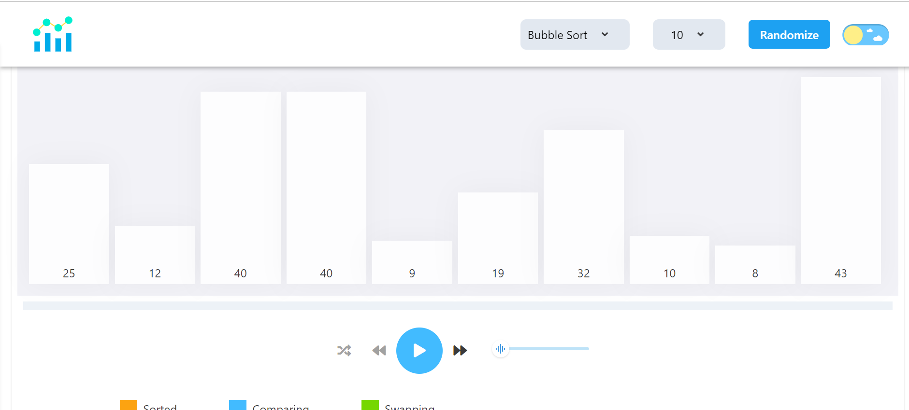
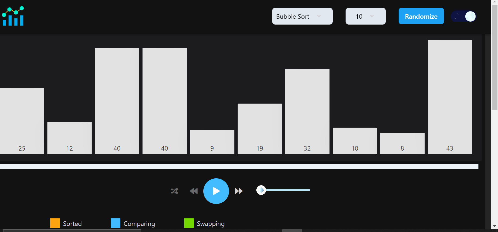

<p align="center">
  <a href="#">
    
  </a>
</p>

This is a Web-App built using Reactjs and [Chakra-ui](https://chakra-ui.com/) and it is used to visualize the world of sorting algorithms such as insertion sort, merge sort, quick sort, heap sort, etc.

[](https://github.com/jasbirrajrana) [](https://github.com/jasbirrajrana) [](https://github.com/jasbirrajrana) [](http://javascript.info/)

> **Light Mode**



> **Dark Mode**



## Want to contribute?

[](https://github.com/jasbirrajrana/sortVisualizer/issues) [](https://github.com/jasbirrajrana/sortVisualizer/pulls)

> Please check issues **[here](https://github.com/jasbirrajrana/sortVisualizer/issues)**!

**MIT &copy; [Jasbir Rajrana](https://github.com/jasbirrajrana/sortVisualizer/blob/master/LICENSE)**

Let's **[get connected](https://www.linkedin.com/in/jasbirrajrana/)** if we share the same views!
Invite me to connect on **[LinkedIn](https://www.linkedin.com/in/jasbirrajrana/)**.

[](https://www.instagram.com/jasbirrajrana_/) [](https://www.linkedin.com/in/jasbirrajrana/)

```js
if (_.isAwesome(thisRepo)) {
  thisRepo.star(); // thanks in advance :P
}
```
